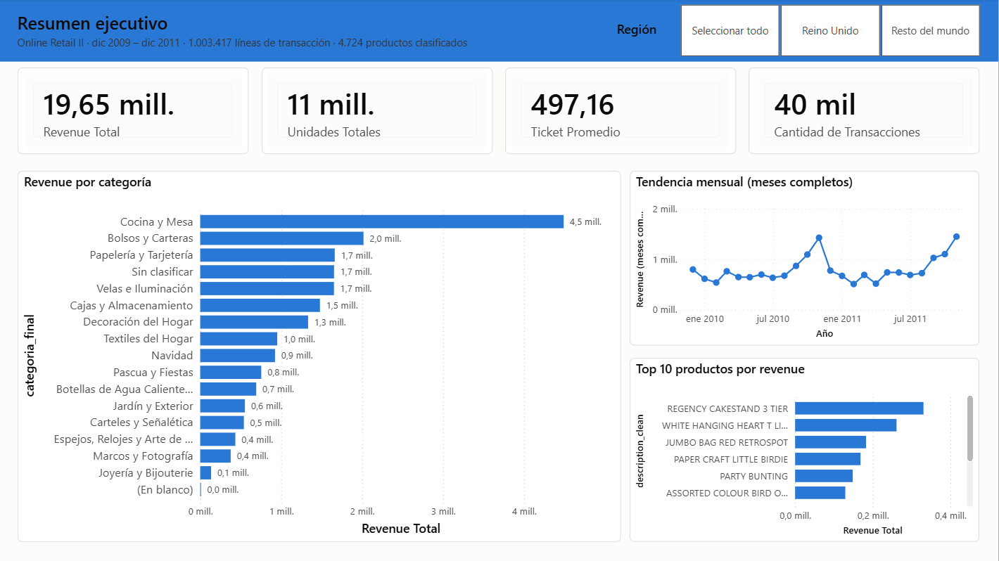
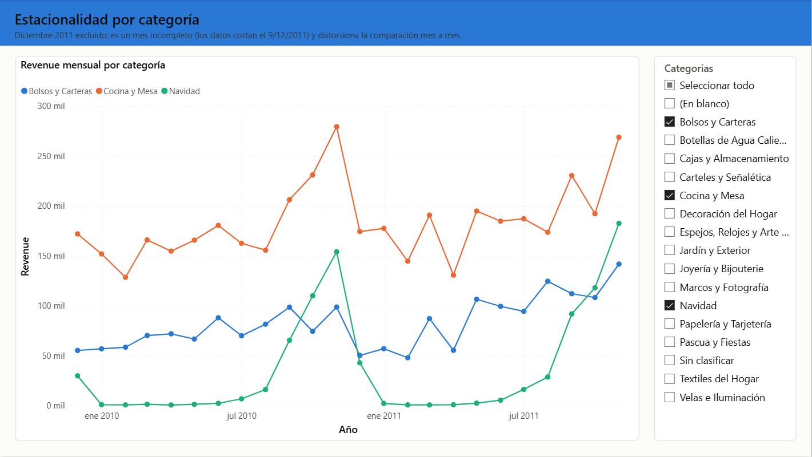
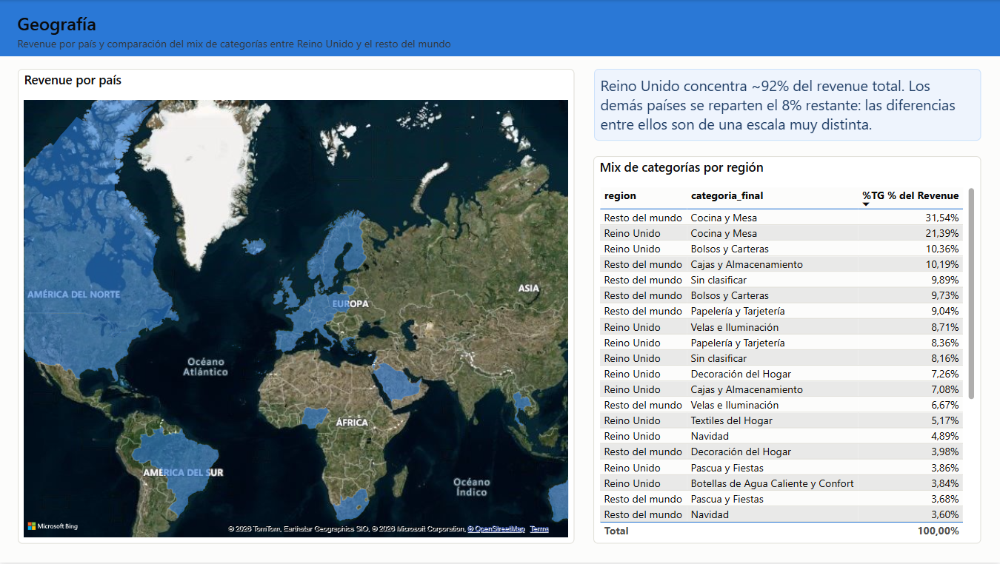
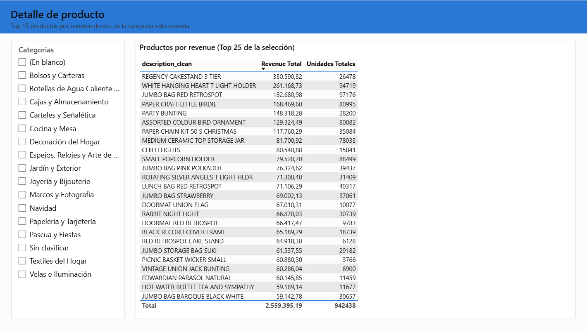

# Clasificación de Productos y Análisis de Ventas


## Descripción del proyecto

Este proyecto parte de un dataset curado de transacciones de **Online Retail II**: contiene el
historial de ventas de un mayorista de regalos y artículos para el hogar del Reino Unido, con la
descripción de cada producto — pero **sin ninguna categoría comercial**. No existía una columna
`y` para entrenar un clasificador.

El proyecto construye esa columna desde cero con un enfoque de **weak supervision**: reglas de
keywords generan etiquetas aproximadas para la mayoría del catálogo, una muestra de ~400
productos etiquetada a mano (a ciegas, sin ver la predicción de las reglas) sirve como única
fuente de verdad confiable, y un modelo supervisado (TF-IDF + SVM lineal) se entrena sobre las
reglas pero se **evalúa contra el gold** — la única forma honesta de saber si generaliza más allá
de lo que las reglas pudieron capturar. El resultado clasifica los 4.724 productos del catálogo
en 15 categorías comerciales, que después se usan para analizar el comportamiento de las ventas
y armar un dashboard interactivo en Power BI.

## Objetivos

- Construir un catálogo canónico de productos a partir de transacciones con errores de tipeo y
  descripciones inconsistentes.
- Descubrir una taxonomía de categorías comerciales mediante clustering exploratorio sobre las
  descripciones (no inventarla a ciegas).
- Etiquetar el catálogo con reglas de keywords y validar su calidad contra un set gold etiquetado
  a mano.
- Entrenar y evaluar un modelo supervisado que supere el baseline de reglas en datos que nunca vio.
- Aplicar el modelo al catálogo completo con calibración de confianza, para no forzar una
  predicción cuando el modelo genuinamente no sabe.
- Analizar el comportamiento de ventas por categoría: revenue, estacionalidad, geografía y
  productos destacados.
- Comunicar los resultados en un dashboard interactivo de Power BI.

## Dataset

**Fuente:** [Online Retail II](https://archive.ics.uci.edu/dataset/502/online+retail+ii) (UCI),
en una versión ya curada por mí a partir del dataset original.

| Métrica | Valor |
|---|---|
| Transacciones | 1.003.417 |
| Rango de fechas | 2009-12-01 → 2011-12-09 *(diciembre 2011 incompleto — corta el día 9)* |
| Productos únicos tras deduplicación | 4.724 |
| País dominante | Reino Unido (~92% del revenue) |

El dataset original tenía 5.613 pares `(stock_code, description)` para solo 4.902 códigos de
producto — 646 códigos tenían hasta 4 descripciones distintas por errores de tipeo. El proceso de
deduplicación (elegir la descripción más frecuente en transacciones reales, no la primera que
aparece) y sus verificaciones están en la sección 2 de `product_classifier.ipynb`.

> El CSV crudo (`online_retail_sales.csv`, 123 MB) no está incluido en el repositorio porque
> supera el límite de 100 MB de GitHub. Para reproducir el proyecto, colocarlo en
> `data/main/online_retail_sales.csv` con las columnas: `invoice`, `stock_code`, `description`,
> `quantity`, `invoice_datetime`, `unit_price`, `customer_id`, `country`, `invoice_date`,
> `invoice_time`, `canceled`, `total_price`.

## Metodología

El pipeline completo vive en `product_classifier.ipynb` (clasificación) y
`product_sales_analysis.ipynb` (análisis de negocio + preparación para Power BI), con el
razonamiento detrás de cada decisión documentado en el propio notebook. En resumen:

1. **Catálogo canónico** — deduplicar transacciones a nivel producto, resolviendo variantes de
   descripción por frecuencia real de uso.
2. **Clustering exploratorio** — TF-IDF + K-Means (sobre-clusterizado a K=45, después fusionado a
   mano) para descubrir qué categorías de producto existen naturalmente en el catálogo.
3. **Taxonomía** — 15 categorías comerciales mutuamente excluyentes, definidas a partir de los
   clusters.
4. **Etiquetado débil por reglas** — diccionario de keywords en orden de prioridad; cobertura
   final del 67,3% del catálogo.
5. **Set gold** — 400 productos (~25 por categoría, muestreo estratificado, no proporcional) 
   etiquetados a mano **sin ver la predicción de la regla**, para que la evaluación sea honesta.
6. **Modelo supervisado** — TF-IDF (palabras + caracteres) + SVM lineal, comparado contra Dummy,
   Naive Bayes y Regresión Logística vía validación cruzada, afinado con `GridSearchCV`.
7. **Inferencia + calibración** — predicción sobre las 4.724 filas del catálogo, con un umbral de
   confianza (calibrado contra el gold, no elegido a ojo) que evita forzar una predicción cuando
   el modelo no tiene señal real.

## Resultados del modelo

| Métrica | Valor |
|---|---|
| Cobertura de las reglas sobre el catálogo | 67,3% |
| Accuracy de las reglas vs. gold (huecos de cobertura como error) | 68,2% |
| Accuracy del modelo (SVM lineal) vs. gold | **71,8%** |
| F1 macro del modelo vs. gold | **0,692** |

Un detalle importante para leer estos números bien: la validación cruzada del modelo *sobre los
datos de entrenamiento* da 0,985 de F1 macro — parece espectacular, pero es engañoso: el modelo
entrena con las mismas etiquetas que generaron las reglas, así que ese número mide qué tan bien
imita las reglas, no si funciona de verdad. El 71,8%/0,692 contra el gold es la medida honesta, y
es la que efectivamente supera tanto al Dummy como al baseline de reglas.

## Análisis de ventas — hallazgos principales

- **Revenue total:** £19,65 millones en 1.003.417 líneas de transacción.
- **`Cocina y Mesa`** lidera con 22,9% del revenue — coherente con un mayorista de regalos y
  hogar, donde la vajilla y utensilios de cocina son de alta rotación.
- **Estacionalidad:** el pico de revenue ocurre en **noviembre**, no en diciembre, y se repite
  igual en 2010 y 2011. Tiene sentido tratándose de un *mayorista*: sus clientes (comercios)
  reponen stock de productos navideños *antes* de la temporada de fin de año, no durante ella.
- **Geografía:** Reino Unido concentra ~92% del revenue. Entre los compradores internacionales,
  `Cocina y Mesa` está sobrerrepresentada (31,5% vs. 21,4% en UK) — el resto del mundo concentra
  sus compras en artículos utilitarios más que en decorativos. `Botellas de Agua Caliente y
  Confort` pesa más en UK (3,8% vs. 1,7%) — un producto culturalmente muy británico, buen chequeo
  de sanidad de que el análisis captura señal real.

## Dashboard interactivo (Power BI)

El catálogo categorizado y las transacciones se modelaron en un esquema estrella
(`fact_ventas` + `dim_producto` + `dim_fecha`) y se armó un dashboard de 4 páginas en
`powerbi_dashboards.pbix`.

**Resumen ejecutivo** — KPIs generales, revenue por categoría, tendencia mensual total y top 10
productos.



**Estacionalidad por categoría** — revenue mensual de las categorías más grandes más Navidad,
con diciembre 2011 excluido explícitamente por estar incompleto.



**Geografía** — revenue por país y comparación del mix de categorías entre Reino Unido y el
resto del mundo.



**Detalle de producto** — top de productos por revenue, filtrable por categoría.



El layout del `.pbix` (posiciones, medidas DAX, tema de color) se genera y verifica de forma
programática con `scripts/restyle_pbix.py` y `scripts/verify_pbix.py`, en vez de armarse a mano
visual por visual.

## Tecnologías utilizadas

- Python 3.14
- Pandas / NumPy
- scikit-learn (TF-IDF, K-Means, SVM lineal, `GridSearchCV`)
- Matplotlib / Seaborn
- Jupyter Notebook
- Power BI Desktop

## Estructura del proyecto

```text
product-classifier-project/
│
├── data/
│   ├── main/
│   │   └── online_retail_sales.csv        # no versionado (123 MB, ver Dataset)
│   └── processed/
│       ├── products_catalog.csv           # catalogo canonico (Paso 1)
│       ├── gold_labels.csv                # 400 productos etiquetados a mano (Paso 5)
│       ├── products_categorized.csv       # catalogo con categoria_final (Paso 7)
│       ├── dim_producto.csv               # dimension de producto (Power BI)
│       ├── dim_fecha.csv                  # dimension de fecha (Power BI)
│       └── fact_ventas.csv                # no versionado (93 MB, se regenera localmente)
│
├── images/
│   ├── resumen_dashboard.png
│   ├── estacionalidad_dashboard.png
│   ├── geografia_dashboard.png
│   └── detalle_dashboard.png
│
├── scripts/
│   ├── restyle_pbix.py                    # edicion programatica del layout del .pbix
│   └── verify_pbix.py                     # verificacion de integridad del .pbix
│
├── product_classifier.ipynb               # Pasos 0-7: catalogo -> modelo -> inferencia
├── product_sales_analysis.ipynb           # analisis de ventas + export a Power BI
├── powerbi_dashboards.pbix
│
├── README.md
├── requirements.txt
└── .gitignore
```

## Cómo reproducir

1. Clonar el repositorio, crear un entorno virtual e instalar dependencias:
   ```bash
   pip install -r requirements.txt
   ```
2. Descargar el dataset de Online Retail II y guardarlo como
   `data/main/online_retail_sales.csv` (ver columnas esperadas en la sección Dataset).
3. Correr `product_classifier.ipynb` de punta a punta. Genera `products_catalog.csv`,
   `gold_labels.csv` (ya incluido, es trabajo manual) y `products_categorized.csv`.
4. Correr `product_sales_analysis.ipynb`. Genera el análisis y las tres tablas del esquema
   estrella — `fact_ventas.csv` no está versionado (pesa ~93 MB), se regenera acá localmente.
5. Abrir `powerbi_dashboards.pbix` en Power BI Desktop; si los orígenes de datos apuntan a rutas
   distintas, actualizarlos desde **Inicio → Transformar datos → Origen de datos**.

## Limitaciones conocidas

- `Decoración del Hogar` y `Papelería y Tarjetería` son las categorías más débiles del modelo
  (F1 ≈ 0,27 y ≈ 0,44) — son, por diseño, las más "catch-all" de la taxonomía y se solapan
  semánticamente con el resto.
- La categoría `Otros` nunca aparece en el entrenamiento débil, así que el modelo no puede
  predecirla — se resuelve parcialmente con el umbral de confianza del Paso 7, no del todo.
- Diciembre 2011 tiene datos incompletos (corta el día 9) — excluido explícitamente de cualquier
  comparación mensual, tanto en el notebook como en el dashboard.

## Autor

**Agustín Pluda**
